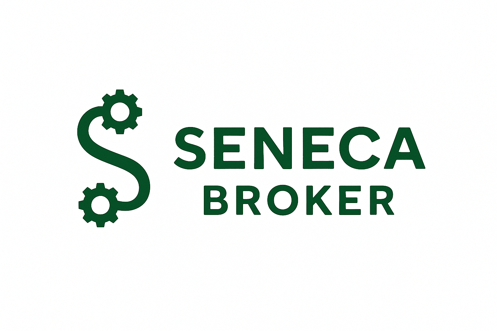

# Seneca

**Seneca** is a Kafka-compatible distributed message broker, written in Rust for performance, safety, and simplicity.

> Inspired by the resilience of Stoic philosophy and the elegance of modern systems programming.

## Goals

- Kafka wire protocol compatibility
- High-throughput append-only log
- Leader-follower replication
- Pluggable storage and transport layers
